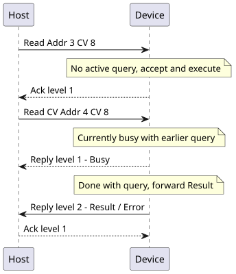

# MX1Bin
This document is a rewrite of the original [document](https://github.com/ZIMO-Elektronik/ULF_MX1BIN/blob/master/data/The%20serial%20communication%20of%20the%20MX1_MXULF_V5_9.pdf) in Markdown in an attempt to make corrections and additions easier. 

> Note, this rewrite is incomplete and only reflects Elements that are part of this library

  
Table of Contents

  <ol>
    <li><a href="#communication-basics">Communication basics</a></li>
    <li><a href="#flow-control">Flow control</a></li>
    <li><a href="#the-new-binary-communication">The new binary communication</a></li>
    <ul>
      <li><a href="#header-info">Header info</a></li>
      <li><a href="#frame-structure">Frame structure</a></li>
    </ul>
      <li><a href="messages">Messages</a></li>
    <ul>
      <li><a href="#short-frame-protocol-primary-messages">Short frame protocol primary messages</a></li>
      <li><a href="#short-frame-protocol-reply-messages">Short frame protocol reply messages</a></li>
      <li><a href="#long-frame-protocol-primary-messages">Long frame protocol primary messages</a></li>
      <li><a href="#long-frame-protocol-reply-messages">Long frame protocol reply messages</a></li>
    </ul>
    <li><a href="#protocol-details">Protocol details</a></li>
    <ul>
      <li><a href="#address-format">Address format</a></li>
      <li><a href="#speed-step-system">Speed step system</a></li>
      <li><a href="#error-codes">Error codes</a></li>
      <li><a href="#data-flow-information">Data flow information</a></li>
    </ul>
  </ol>

## Communication basics
The basic communication format is N,8,1 (no parity, 8 data bits, 1 stop bit). Communication speed
ranges from 1200 to 38400 bit/s and can be selected via CV12. The default value is 9600 bit/s.

## Flow control
Flow control is done via hardware (RTS/CTS). It is necessary to use a serial cable with at least 5
wires which also connects the RTS and CTS lines between PC and command station. Hardware flow
control can be disabled by setting CV13 to 0. Default value is 1 (hardware flow control enabled).

## The new binary communication
The new binary communication consists of data frames with the following structure: 

- Short frames: [`SOH`-`SOH`-`Header`-`Message`-`CRC8`-`EOT`]

- Long frames: [`SOH`-`SOH`-`Header`-`Message`-`CRC16`-`EOT`]

To establish a data transmission independent of content, all data (including headerinfo and check-
sum) characters identical to control characters have to be protected with the additional escape char-
acter prefix <DLE> and the character itself is XOR'ed with `0x20`.

| Control character | Value  | Replacement within data | Description           |
| :---------------: | ------ | ----------------------- | --------------------- |
| `SOH`             | `0x01` | `DLE`(`SOH` \^ `0x20`)  | Start of a data frame | 
| `EOT`             | `0x17` | `DLE`(`EOT` \^ `0x20`)  | End of a data frame   | 
| `DLE`             | `0x10` | `DLE`(`DLE` \^ `0x20`)  | Escape character      | 

Each data frame is immediately acknowledged by the receiver (level 1 reply). This reply may contain
the appropriate data if it's immediately available in the command station. Otherwise the request is
passed on via the CAN bus (to another station for example) and the subsequent incoming data is re-
turned (level 2 reply).

Please note: Future expansions of single messages may involve additional bytes added to the frame.

### Header info
The header info describes the meaning of the data content of a frame. The length of the header info
is between 2 and 15 bytes. The first byte is the unique sequence-ID of the frame and must not be
identical in two different consecutive frames. If a frame has to be repeated the sequence-ID remains
unchanged. The second byte specifies the message type and the meaning of additional header
bytes. Most messages are identified by the contents if the 2nd and 3rd header byte. The 2nd byte pro-
vides some kind of routing information the 3rd byte identifies a specific message. Together these two
bytes might be considered as unique 16 bit message identifier.

#### Common information in header byte 2: 

| Bit(s) | Value                      | Description |
| :----: | -------------------------- | ----------- |
| [7]    | 0   1                   | Short frame   Long frame |
| [6..5] | 00   10   01   11 | Primary message   Ack / Reply level 1   Reply level 2   Ack (for Reply level 2) |
| [4]    | 0   1                   | Sent by command station   Sent by PC |
| [3..0] | 0   1   2            | Target is command station (MX1)   Target is accessory module (MX8)   Target is track section module (MX9) |

Bits 4-0 may alternatively considered to be a 5 bit part of the unique message identifier. It should not
be taken for granted that “useless” bit combinations involving bit 4 strictly interpreted as origin identi-
fier that are not used at this stage might not be assigned some other meaning some day.

### Frame structure
Generally, each frame is split into a 3 / 5 byte header and N byte message. Additionally, the Frame is prefixed with 2 byte \<SOF\> and suffixed with the CRC8 / CRC16 and 1 byte \<EOF\>. 

The Unique sequence-ID (uSID) is upward counting and can is counted seperatly for PC and Module. 

The message code identifies the implied instruction, as well as the structure / length of the message itself. 

Message bytes marked with `optional` are handled if present. Bytes marked with `if no error` are only present, if no error occurred. This implies, that the sturcture of messages can change depending on message values. 

#### Short Frames
Short message frames are secured with a CRC8. The CRC is initialized with `0xFF` and is represented with the polynom ***x8 + x5 + x4 + 1***. The header is structured as follows: 

| Header byte(s)  | Value   | Description           |
| :-------------- | ------- | --------------------- |
| [0]             | 0..255  | Unique sequence-ID    |
| [1]             | I       | Header Info byte (I)  |
| [2]             | C       | Message code (C)      |

Short frames can hold up to 15 bytes (unencoded) of data (including the header). This includes header and message, but not `SOF`, `EOF` and CRC. 

#### Long Frames
Long message frames are secured with a CRC16. The CRC is initialized with `0xFFFF` and is represented with the polynom ***x16 + x12 + x5 + 1***. The header is structured as follows: 

| Header byte(s)  | Value     | Description                                                                 |
| :-------------- | --------- | --------------------------------------------------------------------------- |
| [0]             | 0..255    | Unique sequence-ID                                                          |
| [1]             | I         | Header Info byte (I)                                                        |
| [2]             | C         | Message code (C)                                                            |
| [3]             | dd00nnnn  | dd - [Flow information](#data-flow-information)   n..n Length of header  |

## Messages

### Short frame protocol primary messages

<h4 id="reset_pri">Reset : Code 0 - Primary - Any</h4>
Reset message. Upon receiving this message, the internal state to be reset. This is a header-only message.

Reply: [Ack Level 1](#generic_ack)

<h4 id="track-control_pri">Tack Control : Code 2 - Primary - Command station</h4>
Message to control the state of the track. Instructions should be handled immediatly. 

| Message byte(s) | Name    | Value                  | Description |
| :-------------- | ------- | ---------------------- | ----------- |
| [0]             | cAction | 0   1   2   3 | Broadcast stop (Stop all locos)   Switch track voltage OFF   Switch track voltage ON   Query track status |

Reply: [Ack Level 1](#generic_ack)

<h4 id="loco-control_pri">Loco Control : Code 3 - Primary - Command station</h4>
Message to control a single loco on the track. 

| Message byte(s) | Name   | Value             | Description                                        |
| :-------------- | ------ | ----------------- | -------------------------------------------------- |
| [0..1]          | cAdr   | ffaaaaaa aaaaaaaa | ff - [Format](#address-format)   a..a - Address |
| [2]             | cSpeed | esssssss          | e - Emergency stop   s..s - Speed               |
| [3] optional    | cData1 | -                 | [7] Manual (ignore limits)   [6] N/A   [5] Direction (0 = fw, 1 = bw)   [4] Headlights (=DCC F0)   [3..2] Speed step system   [1] Decel. time enabled   [0] accel. time enabled | 
| [4] optional    | cData2 | -                 | [7..0] F1..F8 (DCC only)                           |
| [5] optional    | cData3 | -                 | [3..0] F9..F12 (DCC only)                          |
| [6] optional    | cData4 | -                 | [7..0] F13..F20 (DCC only)                         | 
| [7] optional    | cData5 | -                 | [7..0] F21..F28 (DCC only)                         |

Reply: [Reply level 1](#loco-control_re)

<h4 id="invert-bits_pri">Invert function bits : Code 4 - Primary - Command station</h4>
Message to invert function bits instead of setting

| Message byte(s) | Name   | Value             | Description                            |
| :-------------- | ------ | ----------------- | -------------------------------------- |
| [0..1]          | cAdr   | ffaaaaaa aaaaaaaa | ff - [Format](#address-format)   a..a - Address |
| [2]             | cSpeed | esssssss          | e - Emergency stop   Speed          |
| [3]             | cData1 | -                 | [7] Manual (ignore limits)   [6] N/A   [5] Direction (0 = fw, 1 = bw)   [4] Headlights (=DCC F0)   [3..2] Speed step system   [1] Decel. time enabled   [0] accel. time enabled | 
| [4]             | cData2 | -                 | [7..0] F1..F8 (DCC only)               |
| [5]             | cData3 | -                 | [3..0] F9..F12 (DCC only)              |
| [6]             | cData4 | -                 | [7..0] F13..F20 (DCC only)             | 
| [7]             | cData5 | -                 | [7..0] F21..F28 (DCC only)             |

Reply: [Reply level 1](#loco-control_re)

<h4 id="accel-deccel_pri">Acceleration / Deceleration : Code 5 - Primary - Command station</h4>
Message to set acceleration and decelartion times. 

| Message byte(s) | Name   | Value             | Description                              |
| :-------------- | ------ | ----------------- | ---------------------------------------- |
| [0..1]          | cAdr   | ffaaaaaa aaaaaaaa | ff - [Format](#address-format)   a..a - Address   |
| [2]             | cAzBz  | -                 | [0..3] BZ (0..15)   [4..7] AZ (0..15) |

Reply: [Reply level 1](#loco-control_re)

<h4 id="shuttle-train_pri">Shuttle train : Code 6 - Primary - Command station</h4>

| Message byte(s) | Name   | Value             | Description                              |
| :-------------- | ------ | ----------------- | ---------------------------------------- |
| [0..1]          | cAdr   | ffaaaaaa aaaaaaaa | ff - [Format](#address-format)   a..a - Address   |
| [2]             | cData  | -                 | [0..3] Contact rails 1..4 forward   [4..7] Contact rails 1..4 reverse |

Reply: [Reply level 1](#loco-control_re)

<h4 id="accessory-decoder_pri">Accessory decoder : Code 7 - Primary - Command station</h4>

| Message byte(s) | Name   | Value             | Description                              |
| :-------------- | ------ | ----------------- | ---------------------------------------- |
| [0..1]          | cAdr   | ffaaaaaa aaaaaaaa | ff - [Format](#address-format)   a..a - Address   |
| [2]             | cData  | -                 | [3] 1=on, 0=off   [2..0] output number |

Reply: [Reply level 1](#accessory-control_re)

<h4 id="loco-memory-query_pri">Query command station's loco memory : Code 8 - Primary - Command station</h4>

| Message byte(s) | Name   | Value             | Description                              |
| :-------------- | ------ | ----------------- | ---------------------------------------- |
| [0..1]          | cAdr   | ffaaaaaa aaaaaaaa | ff - [Format](#address-format)   a..a - Address   |

Reply: [Reply level 1](#loco-memory-query_re)

<h4 id="accessory-memory-query_pri">Query command station's accessory decoder memory : Code 9 - Primary - Command station</h4>
 
| Message byte(s) | Name   | Value             | Description                              |
| :-------------- | ------ | ----------------- | ---------------------------------------- |
| [0..1]          | cAdr   | ffaaaaaa aaaaaaaa | ff - [Format](#address-format)   a..a - Address   |

Reply: [Reply level 1](#accessory-memory-query_re)

<h4 id="address-control_pri">Address control : Code 10 - Primary - Command station</h4>

| Message byte(s) | Name   | Value             | Description                              |
| :-------------- | ------ | ----------------- | ---------------------------------------- |
| [0..1]          | cAdr   | ffaaaaaa aaaaaaaa | ff - [Format](#address-format)   a..a - Address   |
| [2] | cControl | - | [7] 0=Query, 1=Set   [5] 0=Loco, 1=Accessory   [1] Lock address against external changes   [0] Log external changes |
| [3] optional | cOutputs | - | For accessory decoder addresses: The outputs that shall be locked may be defined – keep in mind that there need to be 2 bits set for each paired output, if zero locking is deactivated |

Reply: [Reply level 1](#address-control_re)

<h4 id="read-command-station-io_pri">Read command station I/O state : Code 11 - Primary - Command station</h4>
> Nobody knows, what the `zero` byte's purpose in this message is. However, the protocol does depend on it being there :sweat_smile:

| Message byte(s) | Name | Value | Description     |
| :-------------- | ---- | ----- | --------------- |
| [1]             | zero | 0     | Command station |

Reply: [Reply level 1](#read-command-station-io_re)

<h4 id="read-set-command-station-cv_pri">Read / set a command station CV : Code 12 - Primary - Command station</h4>
Some older command stations have internal CV settings. These can be manipulated with this message. 

> Any command station without CVs should just answer with an [Ack](#generic-ack)

| Message byte(s) | Name     | Value | Description                     |
| :-------------- | -------- | ----- | ------------------------------- |
| [0..1]          | Variable | -     | CV address                      |
| [2] optional    | Value    | -     | If present, set as new CV-value |

Depending on if the `Value` byte is present, the `Variable` is either read, or set. 

Reply: [Reply level 1](#read-set-command-station-cv_re)

<h4 id="command-station-equipment-query_pri">Command station equipment query : Code 13 - Primary - Command station</h4>
> Nobody knows, what the `zero` byte's purpose in this message is. However, the protocol does depend on it being there :sweat_smile:

| Message byte(s) | Name | Value | Description     |
| :-------------- | ---- | ----- | --------------- |
| [1]             | zero | 0     | Command station |

Reply: [Reply level 1](#command-station-equipment-query_re)

<h4 id="read-set-decoder-cv_pri">Read / Set a decoder CV : Code 19 - Primary - Command station</h4>
> At this time, the command station only supports CV read/set commands for DCC decoder addresses.

This message opens a query with the message parameters. Only one query can be active at a time and the result is transmitted asynchronously with a Reply level 2. 

| Message byte(s) | Name      | Value             | Description                             |
| :-------------- | --------- | ----------------- | --------------------------------------- |
| [0..1]          | cAdr      | ffaaaaaa aaaaaaaa | ff - [Format](#address-format)   a..a - Address  |
| [2..3]          | Variable  | -                 | CV address                              |
| [4] optional    | Value     | -                 | If present, set as new CV-value         |

Depending on if the `Value` byte is present, the `Variable` is either read, or set. 

If the address (excluding the format specifier) is 0, the query is handled in DCC Service mode. Otherwise, On-The-Main programming is used.

Reply: [Reply level 1](#generic-ack) -> [Reply level 2](#read-set-decoder-cv_re)

***OR - If another query is already active***

Reply: [Reply level 1](#read-set-decoder-cv-busy_re)

<h4 id="current-loco-memory_pri">Current loco memory : Code 255 - Primary - Command station</h4>

If logging is activated for a loco address ([Address Control](#address-control-pri)), this message is sent whenever the loco memory state changes due to external input (e.g. command station interface).

| Message byte(s) | Name      | Value             | Description                             |
| :-------------- | --------- | ----------------- | --------------------------------------- |
| [0..1]          | cAdr      | ffaaaaaa aaaaaaaa | ff - [Format](#address-format)   a..a - Address  |
| [2]             | cSpeed    | -                 | Speed in step system |
| [3]             | cData1    | -                 | [7] Manual (ignore limits)   [6] N/A   [5] Direction (0 = fw, 1 = bw)   [4] Headlights (=DCC F0)   [3..2] Speed step system   [1] Decel. time enabled   [0] accel. time enabled |
| [4]             | cData2    | -                 | [7..0] F1..F8 (DCC only)                |
| [5]             | cData3    | -                 | [3..0] F9..F12 (DCC only)               |
| [6]             | cAzBz     | -                 | [0..3] BZ (0..15)   [4..7] AZ (0..15)|
| [7]             | cStatus   | 0   1          | Inactive   Active                    |
| [8] optional    | cData4    | -                 | [7..0] F13..F20 (DCC only)              |
| [9] optional    | cData5    | -                 | [7..0] F21..F28 (DCC only)              |

Reply: [Ack](#generic-ack)

<h4 id="current-accessory-memory_pri">Current accessory decoder memory : Code 254 - Primary - Command station</h4>

If logging is activated for a loco address ([Address Control](#address-control-pri)), this message is sent whenever the accessory decoder memory state changes due to external input (e.g. command station interface).

| Message byte(s) | Name      | Value             | Description                                         |
| :-------------- | --------- | ----------------- | --------------------------------------------------- |
| [0..1]          | cAdr      | ffaaaaaa aaaaaaaa | ff - [Format](#address-format)   a..a - Address              |
| [2]             | cPair     | 0   1          | Paired output function   single output function  |
| [3]             | cOutputs  | -                 | State of the Outputs                                |

Reply: [Ack](#generic-ack)

### Short frame protocol reply messages

<h4 id="generic-ack">Ack : Code C - Reply level 1 - Any</h4>
A generic Ack that confirms the message reception. This message inherits the message code of the matching primary message 

| Message byte(s) | Value      | Description                         |
| :-------------- | ---------- | ----------------------------------- |
| [0]             | Primary-ID | uSID of the replied primary message |

Reply: None

<h4 id="generic-nak">Nak : Code 1 - Reply level 1 - Any</h4>
A generic Nak that implies problems during message reception. This is a header-only message.

Reply: None

<h4 id="loco-control_re">Loco control : Code 3 / 4 / 5 / 6 - Reply level 1 - Command station</h4>
In case there is no error within a request, the level 1 acknowledgement contains additional information. If the track state is not in normal operational mode bit 0 is set. 

The actual track state needs to be queried seperatly using (Track Control)[#track-control_pri]

| Message byte(s) | Name    | Value     | Description                                                                                 |
| :-------------- | ------- | --------- | ------------------------------------------------------------------------------------------- |
| [0]             | re-uSID | ID        | uSID of the message being replied to                                                        |
| [1]             | Error   | -         | If any - Error                                                                              |
| [2] if no Error | Status  | ff00ss0t  | ff - [Format](#address-format)   ss - [Speed step system](#speed-step-system)   t - track state (0 = normal, 1 = fault) |

Reply: None

<h4 id="accessory-control_re">Accessory control : Code 7 - Reply level 1 - Command station</h4>
In case there is no error within a request, the level 1 acknowledgement contains additional information. If the track state is not in normal operational mode bit 0 is set. 

The actual track state needs to be queried seperatly using (Track Control)[#track-control_pri]

| Message byte(s) | Name    | Value     | Description                                                       |
| :-------------- | ------- | --------- | ----------------------------------------------------------------- |
| [0]             | re-uSID | ID        | uSID of the message being replied to                              |
| [1]             | Error   | -         | If any - Error                                                    |
| [2] if no Error | Status  | ff00000t  | ff - [Format](#address-format)   t - track state (0 = normal, 1 = fault) |

Reply: None

<h4 id="loco-memory-query_re">Query command station's loco memory : Code 8 - Reply level 1 - Command station</h4>
In case there is no error within the request, the level 1 acknowledgement contains the requested da-
ta.

| Message byte(s)               | Name      | Value             | Description                             |
| :---------------------------- | --------- | ----------------- | --------------------------------------- |
| [0]                           | re-uSID   | ID                | uSID of the message being replied to    |
| [1]                           | Error     | -                 | If any - Error                          |
| [2..3] if no Error            | cAdr      | ffaaaaaa aaaaaaaa | ff - [Format](#address-format)   a..a - Address  |
| [4] if no Error               | cSpeed    | -                 | Speed in step system |
| [5] if no Error               | cData1    | -                 | [7] Manual (ignore limits)   [6] N/A   [5] Direction (0 = fw, 1 = bw)   [4] Headlights (=DCC F0)   [3..2] Speed step system   [1] Decel. time enabled   [0] accel. time enabled |
| [6] if no Error               | cData2    | -                 | [7..0] F1..F8 (DCC only)                |
| [7] if no Error               | cData3    | -                 | [3..0] F9..F12 (DCC only)               |
| [8] if no Error               | cAzBz     | -                 | [0..3] BZ (0..15)   [4..7] AZ (0..15)|
| [9] if no Error               | cStatus   | 0   1          | Inactive   Active                    |
| [10] if no Error - optional   | cData4    | -                 | [7..0] F13..F20 (DCC only)              |
| [11] if no Error - optional   | cData5    | -                 | [7..0] F21..F28 (DCC only)              |

Reply: None

<h4 id="accessory-memory-query_re">Query command station's accessory decoder memory : Code 9 - Reply level 1 - Command station</h4>
In case there is no error within the request, the level 1 acknowledgement contains the requested da-
ta.

| Message byte(s)     | Name      | Value             | Description                                         |
| :------------------ | --------- | ----------------- | --------------------------------------------------- |
| [0]                 | re-uSID   | ID                | uSID of the message being replied to                |
| [1]                 | Error     | -                 | If any - Error                                      |
| [2..3] if no Error  | cAdr      | ffaaaaaa aaaaaaaa | ff - [Format](#address-format)   a..a - Address              |
| [4] if no Error     | cPair     | 0   1          | Paired output function   single output function  |
| [5] if no Error     | cOutputs  | -                 | State of the Outputs                                |

Reply: None

<h4 id="address-control_re">Address control : Code 10 - Reply level 1 - Command station</h4>

| Message byte(s)             | Name      | Value     | Description                              |
| :-------------------------- | --------- | --------- | ---------------------------------------- |
| [0]                         | re-uSID   | ID        | uSID of the message being replied to     |
| [1]                         | Error     | -         | If any - Error                           |
| [2..3] if no Error          | Status    | ffa0sskl  | ff - [Format](#address-format)   a - Address type (0=Loco, 1=Accessory)   ss - [Speed step system](#speed-step-system)   k - Lock against changes   l - Log changes   |
| [4] if no Error - optional  | cOutputs  | -         | Bit mask of locked accessory outputs    |

Reply: None

<h4 id="read-command-station-io_re">Read command station I/O state : Code 11 - Reply level 1 - Command station</h4>

> Nobody knows, what the `zero` byte's purpose in this message is. However, the protocol does depend on it being there :sweat_smile:

| Message byte(s) | Name      | Value                     | Description                           |
| :-------------- | --------- | ------------------------- | ------------------------------------- |
| [0]             | re-uSID   | ID                        | uSID of the message being replied to  |
| [1]             | zero      | 0                         | values for command station            |
| [2..3]          | cCurrent1 | - [0.01A]                 | Current output 1                      |
| [4]             | cVoltage1 | - [0.1V]                  | Voltage output 1                      |
| [5..6]          | cCurrent2 | - [0.01A] (0 for MX1_EC)  | Current output 2                      |
| [7]             | cVoltage2 | - [0.1V] (0 for MX1_EC)   | Voltage output 2                      |
| [8]             | cAux      | -                         | Auxiliary inputs                      | 

Current values with bit [15] set are one of the special values listed below: 

> Maybe it would be smart to write out the abbreviations below

| Special value | Description                       |
| :------------ | :-------------------------------- |
| 0x8000        | no 2nd value (MX1_EC)  |
| 0x8001        | "OFF"                             |
| 0x8002        | "UEP"                             |
| 0x8003        | "UES"                             |
| 0x8004        | "AUS"                             |
| 0x8005        | "SSP"                             |
| 0x8006        | "No Si"                           |
| 0x8007        | "SL UES"                          |

Reply: None

<h4 id="read-set-command-station-cv_re">Read / set a command station CV : Code 12 - Reply level 1 - Command station</h4>

| Message byte(s) | Name      | Value     | Description                             |
| :-------------- | --------- | --------- | --------------------------------------- |
| [0]             | re-uSID   | ID        | uSID of the message being replied to    |
| [1]             | Error     | -         | If any - Error                          |
| [2] if no Error | cValue    | -         | Value of the CV                         |

Reply: None

<h4 id="read-set-decoder-cv_re">Read / Set a decoder CV : Code 19 - Reply level 2 - Command station</h4>

There are two different replies, depending on wether an error occurred during query exection. If no error occurred, the reply should have the following structure: 

> No idea, what the `cError` byte should accomplish here. On error, a different message is sent anyway. 

| Message byte(s) | Name      | Value             | Description                             |
| :-------------- | --------- | ----------------- | --------------------------------------- |
| [0]             | re-uSID   | ID                | uSID of the message being replied to    |
| [1..2]          | cAdr      | ffaaaaaa aaaaaaaa | ff - [Format](#address-format)   a..a - Address  |
| [3..4]          | Variable  | -                 | CV address                              |
| [5]             | cValue    | -                 | CV value                                |
| [6]             | cError    | -                 | Error (0=No Error, >0= Error)           |

When an Error occurs (e.g. timeout), the following message should be sent: 

| Message byte(s) | Name      | Value             | Description                             |
| :-------------- | --------- | ----------------- | --------------------------------------- |
| [0]             | re-uSID   | ID                | uSID of the message being replied to    |
| [1..2]          | cAdr      | ffaaaaaa aaaaaaaa | ff - [Format](#address-format)   a..a - Address  |
| [3]             | cError    | Error             | Error code                              |

Reply: [Ack](#generic_ack)

<h4 id="read-set-decoder-cv-busy_re">Read / Set a decoder CV - Busy : Code 19 - Reply level 1 - Command station</h4>
Since only one query can be active at a time, any following query should be responded to with the following message: 

| Message byte(s)   | Name      | Value             | Description                                                 |
| :---------------- | --------- | ----------------- | ----------------------------------------------------------- |
| [0]               | re-uSID   | ID                | uSID of the message being replied to                        |
| [1]               | cBusy     | 0x04              | Busy - there is already an active request                   |
| [1..2]            | cAdr      | ffaaaaaa aaaaaaaa | ff - [Format](#address-format)   a..a - Address                      |
| [3..4]            | Variable  | -                 | CV address                                                  |
| [5] optional      | cID       | ID                | uSID of the message requesting the active query             |
| [6] optional      | cError    | -                 | Error (0=No Error, >0= Error)                               |
| [7..8] optional   | cAdr      | ffaaaaaa aaaaaaaa | ff - [Format](#address-format)   a..a - Address of the active query  |
| [9..10] optional  | Variable  | -                 | Variable of the active query                                |

Reply: None

### Long frame protocol primary messages

> [Warning]
> This implementation does not handle any messages of this type yet.

### Long frame protocol reply messages

<h4 id="command-station-equipment-query_re">Command station equipment query : Code 13 - Reply level 1 - Command station</h4>

| Message byte(s)   | Name          | Value   | Description                           |
| :---------------- | ------------- | ------- | ------------------------------------- |
| [0]               | re-uSID       | ID      | uSID of the message being replied to  |
| [1..2]            | cAddress      | -       | Unique (CAN-)address                  |
| [3]               | cDevice       | ID      | Device id (see below)                 |
| [4]               | cRom_size     | -       | ROM size of command station           |
| [5]               | cRam_size     | -       | RAM size of command station           | 
| [6..7]            | cPrintVer     | -       | Print version number                  |
| [8]               | cVersion_h    | -       | SW-Version major                      |
| [9]               | cVersion_m    | -       | SW-Version minor                      |
| [10]              | cDate_day     | D       | Day of SW release                     |
| [11]              | cDate_month   | M       | Month of SW release                   |
| [12]              | cDate_century | C       | Century of SW release                 |
| [13]              | cDate_year    | Y       | Year of SW release                    |
| [14]              | cSwitches     | -       | Switches                              |
| [15]              | cVersion_l    | -       | SW-Version patch                      |
| [16..18]          | cBootRom      | -       | Boot ROM version number               |
| [19]              | zero          | 0       | Values vor command station            |
| [20..23] optional | cSerNum       | -       | 4-byte Serial number                  |  

The Device IDs are predfined values. The possible values are listed below: 

| Device-ID | Device        |
| :-------- | ------------- |
| 1         |MX1 2000 / HS  |
| 2         |MX1 2000 EC    |
| 3         |MX31 ZL        |
| 4         |MXULF          |
| 5         |KLUG           |

Reply: None

## Protocol details

### Address format
The decoder address (usually `cAdr`) byte of a message contains a 2 bit address type identifier. The structure of this identifier changes depending on the message context. 

***For primary messages:***
| [ff] | Description                               |
| ---- | ----------------------------------------- |
| 0 0  | Use protocol last used with this address  |
| 1 0  | Force DCC protocol                        |
| 0 1  | Force Motorola protocol                   |
| 1 1  | `Reserved`                                |

***For replies:***
| [ff] | Description                               |
| ---- | ----------------------------------------- |
| 0 0  | Not used                                  |
| 1 0  | Address uses DCC protocol                 |
| 0 1  | Address uses Motorola protocol            |
| 1 1  | `Reserved`                                |

***For decoder CV access via service mode:***
| [ff] | Description                               |
| ---- | ----------------------------------------- |
| 0 0  | Use protocol last used with this address  |
| 1 0  | Force DCC protocol                        |
| 0 1  | Force Motorola protocol                   |
| 1 1  | `Reserved`                                |

***For decoder CV access via on-the-main programming:***
| [ff] | Description                               |
| ---- | ----------------------------------------- |
| 0 0  | `Reserved`                                |
| 1 0  | `Resetved`                                |
| 0 1  | Decoder address                           |
| 1 1  | Accessory decoder address                 |

### Speed step system
The speed step system identifier changes meaning depending on the message context. The cases are listed below: 

***For primary messages***
| [ss] | Description                                       |
| ---- | ------------------------------------------------- |
| 0 0  | Use speed step system last used with this address |
| 1 0  | Force 14 speed steps (0..14)                      |
| 0 1  | Force 28 speed steps (0..28)                      | 
| 1 1  | Force 126 speed steps (0..126)                    |

***For replies***
| [ss] | Description                                       |
| ---- | ------------------------------------------------- |
| 0 0  | not used                                          |
| 1 0  | Force 14 speed steps (0..14)                      |
| 0 1  | Force 28 speed steps (0..28)                      | 
| 1 1  | Force 126 speed steps (0..126)                    |

### Error codes
The reply to message `0x0A` inherits an additional return code. This return code reflects the logical er-
ror-status of the sent message. If the message is transmitted correctly but there is a logical error
within the message that prevents the command station from executing it, then the codes below indi-
cate the reason for it.

| Return code         | Value | Description                               |
| ------------------- | ----- | ----------------------------------------- |
|NO_ERROR             | 0x00  | No Error                                  |
|ERR_ADRESSE          | 0x01  | Not a valid address                       |
|ERR_INDEX            | 0x02  | Error with the index of extended address  |
|ERR_FORWARD          | 0x03  | Request could't be forwarded              |
|ERR_BUSY             | 0x04  | Busy with another command                 |
|ERR_NO_MOT           | 0x05  | Motorola jumper off                       | 
|ERR_NO_DCC           | 0x06  | DCC jumper off                            |
|ERR_CV_ADRESSE       | 0x07  | Not a valid CV address                    |
|ERR_SECTION          | 0x08  | Not a valid section                       |
|ERR_NO_MODUL         | 0x09  | Module with given address doesn't exist   |
|ERR_MESSAGE          | 0x0A  | Error within message                      |
|ERR_SPEED            | 0x0B  | Given speed not valid                     |
|ERR_ADRESSE_OCUPIED  | 0x0C  | MXULF controls address                    |

### Data flow information
The fourth header byte of long data frames contains, besides the length of the header (original length
without counting escape character prefixes), additional data flow information. This information de-
scribes whether there will be any consecutive frames with data.

| [dd] | Description                    |
| ---- | ------------------------------ |
| 0 0  | No more data                   |
| 0 1  | More data will follow          |
| 1 0  | More data will possibly follow |
| 1 1  | `Reserved`                     |

