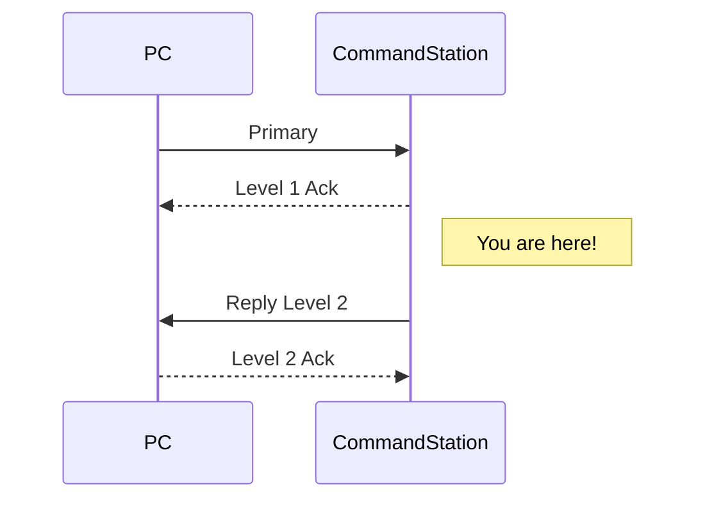

# Level 1 Ack

The `Level 1 Ack` marks the end of the synchronous part of command processign (and the end of most commands). The sender simply assumes that this type of message is always received.

