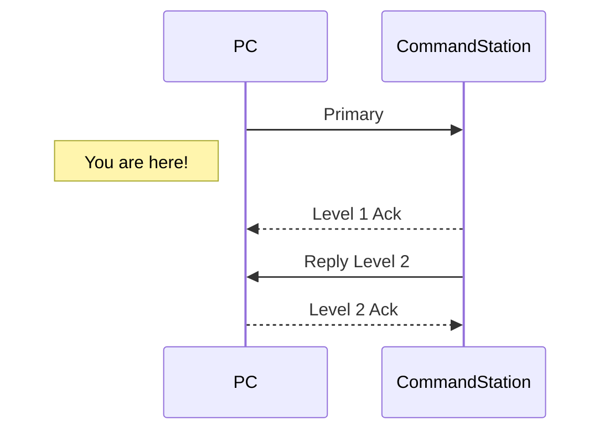

# Primary Message

The primary message serves as starting point for each command. Wether the command can be processed immediatly or will be deferred, a [Level 1 Ack](level_1_ack.md) **MUST** follow

